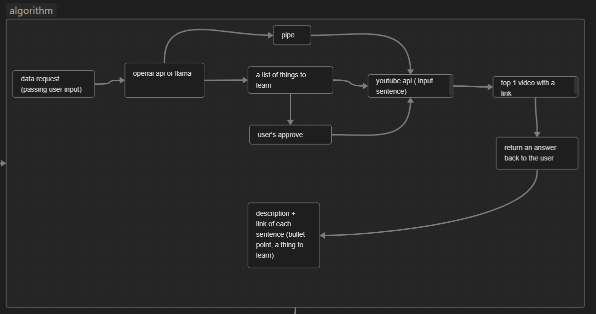

# uPortray-api

## Logic


### Tech stack
- NodeJS
- OpenAI API
- Youtube Data v3 API

### How to use
#### Prerequisites
Set up API keys as environment variables.
To set it for current shell and all processes started from current shell:

```bash
export OPENAI_API_KEY=YOUR_KEY      # shorter, less portable version
export YOUTUBE_API_KEY=YOUR_KEY
```

To set it permanently for all future bash sessions add such line to your .bashrc file in your $HOME directory.

#### Run it
```bash
git clone git@github.com:gonpaul/uPortray-api.git
cd uPortray-api
npm i
node index.js
Artificial intelligence // it's an example, so peek whatever you want
```

### Contribute.
#### Features to build
- [ ] implement user feedback for a chat gpt 3.5-turbo response
- [ ] come up with a solid open ai api request template and design it
- [ ] how to integrate links back into the initial acknowledged openai api response
